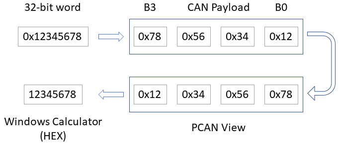

# OCTOPUS CAN Protocol Description

# Table of Contents

[OCTOPUS Internal CAN Description [1](#octopus-internal-can-description)](#octopus-internal-can-description)

[Message Frame [3](#message-frame)](#message-frame)

[MC Register List [4](#mc-register-list)](#mc-register-list)

[Auto-discovery [11](#auto-discovery)](#auto-discovery)

[SC-MCU Register List [12](#_Toc96345599)](#_Toc96345599)

## Message Frame

Table 1 - CAN frame

|            |  SoF  | ID pt.1 |  SRR  |  IDE  | ID pt.2 |  RTR  | reserved | Data Len. | Data  |  CRC  | CRC delim |  ACK  | ACK delim | EOFmodule ala |
| :--------: | :---: | :-----: | :---: | :---: | :-----: | :---: | :------: | :-------: | :---: | :---: | :-------: | :---: | :-------: | :-----------: |
| \# of bits |   1   |   11    |   1   |   1   |   18    |   1   |    2     |     4     |  64   |  15   |     1     |   1   |     1     |       7       |

The CAN ID is then:

<table>
  <caption>
Table 2 - Internal CAN frame
</caption>
  <colgroup>
    <col style="width: 52%" />
    <col style="width: 47%" />
  </colgroup>
  <thead>
    <tr>
      <th><table>
          <colgroup>
            <col style="width: 15%" />
            <col style="width: 15%" />
            <col style="width: 13%" />
            <col style="width: 18%" />
            <col style="width: 13%" />
            <col style="width: 22%" />
          </colgroup>
          <thead>
            <tr>
              <th style="text-align: center;"></th>
              <th colspan="5" style="text-align: center;">CAN ID pt.1</th>
            </tr>
          </thead>
          <tbody>
            <tr>
              <td style="text-align: center;"></td>
              <td style="text-align: center;"><strong>PRIO</strong></td>
              <td colspan="2" style="text-align: center;"><strong>DST</strong></td>
              <td colspan="2" style="text-align: center;"><strong>SRC</strong></td>
            </tr>
            <tr>
              <td style="text-align: center;"><strong>bit</strong></td>
              <td style="text-align: center;">28</td>
              <td colspan="2" style="text-align: center;">27-23</td>
              <td colspan="2" style="text-align: center;">22-18</td>
            </tr>
            <tr>
              <td rowspan="4" style="text-align: center;"><strong>Content</strong></td>
              <td style="text-align: center;">0 = High</td>
              <td style="text-align: center;">0</td>
              <td style="text-align: center;">Broadcast</td>
              <td style="text-align: center;">0</td>
              <td style="text-align: center;">unconfigured</td>
            </tr>
            <tr>
              <td style="text-align: center;">1 = Low</td>
              <td style="text-align: center;">1-29</td>
              <td style="text-align: center;">MC</td>
              <td style="text-align: center;">1-29</td>
              <td style="text-align: center;">MC</td>
            </tr>
            <tr>
              <td style="text-align: center;"></td>
              <td style="text-align: center;">30</td>
              <td style="text-align: center;">SC MCU</td>
              <td style="text-align: center;">30</td>
              <td style="text-align: center;">SC MCU</td>
            </tr>
            <tr>
              <td style="text-align: center;"></td>
              <td style="text-align: center;">31</td>
              <td style="text-align: center;">SC MPU</td>
              <td style="text-align: center;">31</td>
              <td style="text-align: center;">SC MPU</td>
            </tr>
          </tbody>
        </table></th>
      <th><table>
          <colgroup>
            <col style="width: 16%" />
            <col style="width: 17%" />
            <col style="width: 24%" />
            <col style="width: 17%" />
            <col style="width: 25%" />
          </colgroup>
          <thead>
            <tr>
              <th style="text-align: center;"></th>
              <th colspan="4" style="text-align: center;">CAN ID pt.2</th>
            </tr>
          </thead>
          <tbody>
            <tr>
              <td style="text-align: center;"></td>
              <td style="text-align: center;"><strong>reserved</strong></td>
              <td style="text-align: center;"><strong>ParamID</strong></td>
              <td style="text-align: center;"><strong>reserved</strong></td>
              <td style="text-align: center;"><strong>Index</strong></td>
            </tr>
            <tr>
              <td style="text-align: center;"><strong>bit</strong></td>
              <td style="text-align: center;">17</td>
              <td style="text-align: center;">16-9</td>
              <td style="text-align: center;">8</td>
              <td style="text-align: center;">7-0</td>
            </tr>
            <tr>
              <td rowspan="4" style="text-align: center;"><strong>Content</strong></td>
              <td style="text-align: center;"></td>
              <td rowspan="4" style="text-align: center;">
See

                
<em>Register List</em>

                
chapter
</td>
              <td style="text-align: center;"></td>
              <td style="text-align: center;">0 = END</td>
            </tr>
            <tr>
              <td style="text-align: center;"></td>
              <td style="text-align: center;"></td>
              <td style="text-align: center;">1-255 = Index</td>
            </tr>
            <tr>
              <td style="text-align: center;"></td>
              <td style="text-align: center;"></td>
              <td style="text-align: center;"></td>
            </tr>
            <tr>
              <td style="text-align: center;"></td>
              <td style="text-align: center;"></td>
              <td style="text-align: center;"></td>
            </tr>
          </tbody>
        </table></th>
    </tr>
  </thead>
  <tbody>
  </tbody>
</table>

\* MCU listens to specific CAN messages to the MPU (particularly, alarms) despite not being directly addressed. Separate addressing maintained to retain potential future implementation.

Payload is handled as BIG endian:

## MC Register List

<table>
  <caption>
Table 3 – MC CAN registers
</caption>
  <colgroup>
    <col style="width: 10%" />
    <col style="width: 36%" />
    <col style="width: 39%" />
    <col style="width: 13%" />
  </colgroup>
  <thead>
    <tr>
      <th style="text-align: center;">ID</th>
      <th style="text-align: center;">Name</th>
      <th style="text-align: center;">Values</th>
      <th style="text-align: center;">Report intvl</th>
    </tr>
  </thead>
  <tbody>
    <tr>
      <td rowspan="3" style="text-align: center;">0</td>
      <td rowspan="3">Device Statuses</td>
      <td>
Byte (READONLY)

        
<strong>MC Status</strong> 
            2^0 = State error 
            2^1 = Fail Safe Error 
            2^2 = Firmware failed 
            2^3 = Flag reset
</td>
          <td rowspan="3">2s</td>
        </tr>
        <tr>
          <td>
Byte (READONLY)

            
<strong>FPGA Status</strong>

            
Bitwise flags: 
            2^0 = Under cell voltage

              
2^1 = Over cell voltage

              
2^2 = Under cell temp

              
2^3 = Over cell temp

              
2^4 = Keep alive signal (is pulled up)
</td>
          </tr>
          <tr>
            <td>
Byte (READONLY)

              
<strong>Active states</strong>

              
2^0 = Balancing state 
2^1 = Simulation state 
2^2 = Bus Silent - Firmware updating state
</td>
              </tr>
              <tr>
                <td rowspan="2" style="text-align: center;">1</td>
                <td rowspan="2">Internal times</td>
                <td>
UInt32 (READWRITE)

                  
<strong>System Time</strong>

                  
Linux Epoch Timestamp
</td>
                <td rowspan="2"></td>
              </tr>
              <tr>
                <td>
UInt32 (READONLY)

                  
<strong>Uptime</strong>

                  
Uptime seconds
</td>
              </tr>
              <tr>
                <td rowspan="2" style="text-align: center;">2</td>
                <td rowspan="2">Warnings/Alarms</td>
                <td>
UInt32 (READONLY)

                  
<strong>Warnings</strong>

                  
Bitwise flags: 
2^0 = Cell V High Warn

                    
2^1 = Cell V Low Warn

                    
2^2 = Cell T High Warn

                    
2^3 = Cell T Low Warn

                    
2^4 = Ext 1 T High Warn

                    
2^5 = Ext 1 T Low Warn

                    
2^6 = Ext 2 T High Warn

                    
2^7 = Ext 2 T Low Warn

                    
2^8 = Balancing T Low Warn

                    
2^9 = Balancing T High Warn

                    
2^10 = RTC fail

                    
2^11 = External Flash Fail

                    
2^12 = HVIL Detection

                    
2^13 = Cooling fan fail

                    
2^14 = Voltage fuse 1 (3.0V) active

                    
2^15 = Fail Safe Signal Active

                    
2^16 = Temperature sensor out of spec.

                    
2^17 = Simulation mode denied/timeout<a href="#fn1" class="footnote-ref" id="fnref1" role="doc-noteref">1</a>
</td>
                  <td rowspan="2">2s</td>
                </tr>
                <tr>
                  <td>
UInt32 (READONLY)

                    
<strong>Alarms</strong>

                    
Bitwise flags: 
2^0 = Cell V High Error

                      
2^1 = Cell V Low Error

                      
2^2 = Cell T High Error

                      
2^3 = Cell T Low Error

                      
2^4 = Ext 1 T High Error

                      
2^5 = Ext 1 T Low Error

                      
2^6 = Ext 2 T High Error

                      
2^7 = Ext 2 T Low Error

                      
2^8 = LTC Self-test Failure

                      
2^9 = Current sensor over/under spec

                      
2^10 = Uncalibrated Current Sensor

                      
2^11 = Cell Open Wire

                      
2^12 = Leak Detection

                      
2^13 = FPGA Status not OK

                      
2^14 = Voltage fuse 2 (2.7V) active
</td>
                  </tr>
                  <tr>
                    <td rowspan="4" style="text-align: center;">3</td>
                    <td rowspan="4">Cell 1-4 Voltages</td>
                    <td>
UInt16 (READONLY)

                      
<strong>Cell1 mV</strong>
</td>
                    <td rowspan="4"></td>
                  </tr>
                  <tr>
                    <td>
UInt16 (READONLY)

                      
<strong>Cell2 mV</strong>
</td>
                  </tr>
                  <tr>
                    <td>
UInt16 (READONLY)

                      
<strong>Cell3 mV</strong>
</td>
                  </tr>
                  <tr>
                    <td>
UInt16 (READONLY)

                      
<strong>Cell4 mV</strong>
</td>
                  </tr>
                  <tr>
                    <td style="text-align: center;">4-7</td>
                    <td>…</td>
                    <td></td>
                    <td></td>
                  </tr>
                  <tr>
                    <td rowspan="4" style="text-align: center;">8</td>
                    <td rowspan="4">Cell 21-24 Voltages</td>
                    <td>
UInt16 (READONLY)

                      
<strong>Cell21 mV</strong>
</td>
                    <td rowspan="4"></td>
                  </tr>
                  <tr>
                    <td>
UInt16:

                      
<strong>Cell22 mV</strong>
</td>
                  </tr>
                  <tr>
                    <td>
UInt16 (READONLY)

                      
<strong>Cell23 mV</strong>
</td>
                  </tr>
                  <tr>
                    <td>
UInt16 (READONLY)

                      
<strong>Cell24 mV</strong>
</td>
                  </tr>
                  <tr>
                    <td rowspan="8" style="text-align: center;">9</td>
                    <td rowspan="8">Temperature Monitoring Channels 1-8</td>
                    <td>
SByte (READONLY)

                      
<strong>Cell Ch1 °C</strong>
</td>
                    <td rowspan="8"></td>
                  </tr>
                  <tr>
                    <td>
SByte (READONLY)

                      
<strong>Cell Ch 2 °C</strong>
</td>
                  </tr>
                  <tr>
                    <td>
SByte (READONLY)

                      
<strong>Cell Ch 3 °C</strong>
</td>
                  </tr>
                  <tr>
                    <td>
SByte (READONLY)

                      
<strong>Cell Ch 4 °C</strong>
</td>
                  </tr>
                  <tr>
                    <td>
SByte (READONLY)

                      
<strong>Cell Ch 5 °C</strong>
</td>
                  </tr>
                  <tr>
                    <td>
SByte (READONLY)

                      
<strong>Cell Ch 6 °C</strong>
</td>
                  </tr>
                  <tr>
                    <td>
SByte (READONLY)

                      
<strong>Cell Ch 7 °C</strong>
</td>
                  </tr>
                  <tr>
                    <td>
SByte (READONLY)

                      
<strong>Cell Ch 8 °C</strong>
</td>
                  </tr>
                  <tr>
                    <td rowspan="4" style="text-align: center;">10</td>
                    <td rowspan="4">Temperature Auxiliary and Balancing Channels</td>
                    <td>
SByte (READONLY)

                      
<strong>Bal Ch1 °C</strong>
</td>
                    <td rowspan="4"></td>
                  </tr>
                  <tr>
                    <td>
SByte (READONLY)

                      
<strong>Bal Ch2 °C</strong>
</td>
                  </tr>
                  <tr>
                    <td>
SByte (READONLY)

                      
<strong>Ext Ch1 °C</strong>
</td>
                  </tr>
                  <tr>
                    <td>
SByte (READONLY)

                      
<strong>Ext Ch2 °C</strong>
</td>
                  </tr>
                  <tr>
                    <td style="text-align: center;">11</td>
                    <td>Module Current</td>
                    <td>
Int32 (READONLY)

                      
<strong>mA</strong>
</td>
                    <td></td>
                  </tr>
                  <tr>
                    <td style="text-align: center;">12</td>
                    <td>Module Voltage</td>
                    <td>
UInt32 (READONLY)

                      
<strong>mV</strong>
</td>
                    <td></td>
                  </tr>
                  <tr>
                    <td style="text-align: center;">13</td>
                    <td>Balancing status</td>
                    <td>
UInt32 (READONLY)

                      
<strong>Balancing status flags</strong>

                      
Bitwise flags:

                      
2^0 = Cell 1 Balancing enabled

                      
2^1 = Cell 2 Balancing enabled

                      
2^2 = Cell 3 Balancing enabled

                      
2^3 = Cell 4 Balancing enabled

                      
2^4 = Cell 5 Balancing enabled

                      
2^5 = Cell 6 Balancing enabled

                      
2^6 = Cell 7 Balancing enabled

                      
2^7 = Cell 8 Balancing enabled

                      
2^8 = Cell 9 Balancing enabled

                      
2^9 = Cell 10 Balancing enabled

                      
2^10 = Cell 11 Balancing enabled

                      
2^11 = Cell 12 Balancing enabled

                      
2^12 = Cell 13 Balancing enabled

                      
2^13 = Cell 14 Balancing enabled

                      
2^14 = Cell 15 Balancing enabled

                      
2^15 = Cell 16 Balancing enabled

                      
2^16 = Cell 17 Balancing enabled

                      
2^17 = Cell 18 Balancing enabled

                      
2^18 = Cell 19 Balancing enabled

                      
2^19 = Cell 20 Balancing enabled

                      
2^20 = Cell 21 Balancing enabled

                      
2^21 = Cell 22 Balancing enabled

                      
2^22 = Cell 23 Balancing enabled

                      
2^23 = Cell 24 Balancing enabled
</td>
                    <td></td>
                  </tr>
                  <tr>
                    <td style="text-align: center;">14</td>
                    <td>Detected Open Wires</td>
                    <td>
UInt32 (READONLY)

                      
<strong>Cell Open Wires</strong>

                      
Bitwise flags:

                      
2^0 = Cell 1 Open Wire

                      
2^1 = Cell 2 Open Wire

                      
2^2 = Cell 3 Open Wire

                      
2^3 = Cell 4 Open Wire

                      
2^4 = Cell 5 Open Wire

                      
2^5 = Cell 6 Open Wire

                      
2^6 = Cell 7 Open Wire

                      
2^7 = Cell 8 Open Wire

                      
2^8 = Cell 9 Open Wire

                      
2^9 = Cell 10 Open Wire

                      
2^10 = Cell 11 Open Wire

                      
2^11 = Cell 12 Open Wire

                      
2^12 = Cell 13 Open Wire

                      
2^13 = Cell 14 Open Wire

                      
2^14 = Cell 15 Open Wire

                      
2^15 = Cell 16 Open Wire

                      
2^16 = Cell 17 Open Wire

                      
2^17 = Cell 18 Open Wire

                      
2^18 = Cell 19 Open Wire

                      
2^19 = Cell 20 Open Wire

                      
2^20 = Cell 21 Open Wire

                      
2^21 = Cell 22 Open Wire

                      
2^22 = Cell 23 Open Wire

                      
2^23 = Cell 24 Open Wire
</td>
                    <td></td>
                  </tr>
                  <tr>
                    <td style="text-align: center;">15</td>
                    <td>HW Serial Number Low</td>
                    <td>
UInt64 (READONLY)

                      
<strong>HW Serial Number Low</strong>
</td>
                    <td></td>
                  </tr>
                  <tr>
                    <td style="text-align: center;">16</td>
                    <td>HW Serial Number High</td>
                    <td>
UInt64 (READONLY)

                      
<strong>HW Serial Number High</strong>
</td>
                    <td></td>
                  </tr>
                  <tr>
                    <td style="text-align: center;">17</td>
                    <td>Production Serial</td>
                    <td>
String[64] (READWRITE)

                      
<strong>Production Serial</strong>
</td>
                    <td></td>
                  </tr>
                  <tr>
                    <td style="text-align: center;">18</td>
                    <td>Config Number of Cells</td>
                    <td>
UInt8 (READWRITE)

                      
<strong>Config Number of Battery Cells</strong>
</td>
                    <td></td>
                  </tr>
                  <tr>
                    <td rowspan="4" style="text-align: center;">19</td>
                    <td rowspan="4">Config Cell Voltage Thresholds</td>
                    <td>
UInt16 (READWRITE)

                      
<strong>Config Cell V High Warn Ths</strong>
</td>
                    <td rowspan="4"></td>
                  </tr>
                  <tr>
                    <td>
UInt16 (READWRITE)

                      
<strong>Config Cell V Low Warn Ths</strong>
</td>
                  </tr>
                  <tr>
                    <td>
UInt16 (READWRITE)

                      
<strong>Config Cell V High Error Ths</strong>
</td>
                  </tr>
                  <tr>
                    <td>
UInt16 (READWRITE)

                      
<strong>Config Cell V Low Error Ths</strong>
</td>
                  </tr>
                  <tr>
                    <td rowspan="8" style="text-align: center;">20</td>
                    <td rowspan="8">Config Temperature Warn Thresholds</td>
                    <td>
SByte (READWRITE)

                      
<strong>Config Cell Temp High Ths</strong>
</td>
                    <td rowspan="8"></td>
                  </tr>
                  <tr>
                    <td>
SByte (READWRITE)

                      
<strong>Config Cell Temp Low Ths</strong>
</td>
                  </tr>
                  <tr>
                    <td>
SByte (READWRITE)

                      
<strong>Config Bal Temp High Ths</strong>
</td>
                  </tr>
                  <tr>
                    <td>
SByte (READWRITE)

                      
<strong>Config Bal Temp Low Ths</strong>
</td>
                  </tr>
                  <tr>
                    <td>
SByte (READWRITE)

                      
<strong>Config Ext1 Temp High Ths</strong>
</td>
                  </tr>
                  <tr>
                    <td>
SByte (READWRITE)

                      
<strong>Config Ext1 Temp Low Ths</strong>
</td>
                  </tr>
                  <tr>
                    <td>
SByte (READWRITE)

                      
<strong>Config Ext2 Temp High Ths</strong>
</td>
                  </tr>
                  <tr>
                    <td>
SByte (READWRITE)

                      
<strong>Config Ext2 Temp Low Ths</strong>
</td>
                  </tr>
                  <tr>
                    <td rowspan="6" style="text-align: center;">21</td>
                    <td rowspan="6">Config Temperature Alarm Thresholds</td>
                    <td>
SByte (READWRITE)

                      
<strong>Config Cell Temp High Ths</strong>
</td>
                    <td rowspan="6"></td>
                  </tr>
                  <tr>
                    <td>
SByte (READWRITE)

                      
<strong>Config Cell Temp Low Ths</strong>
</td>
                  </tr>
                  <tr>
                    <td>
SByte (READWRITE)

                      
<strong>Config Ext1 Temp High Ths</strong>
</td>
                  </tr>
                  <tr>
                    <td>
SByte (READWRITE)

                      
<strong>Config Ext1 Temp Low Ths</strong>
</td>
                  </tr>
                  <tr>
                    <td>
SByte (READWRITE)

                      
<strong>Config Ext2 Temp High Ths</strong>
</td>
                  </tr>
                  <tr>
                    <td>
SByte (READWRITE)

                      
<strong>Config Ext2 Temp Low Ths</strong>
</td>
                  </tr>
                  <tr>
                    <td style="text-align: center;">22</td>
                    <td>Config Low Voltage Fuses</td>
                    <td>
UInt8 (READWRITE)

                      
<strong>Low Voltage Fuses</strong>

                      
Bitwise flags:

                      
2^0 = Fuse 1 (3V) (True to reset)

                      
2^1 = Fuse 2 (2.7V) (True to reset)
</td>
                    <td></td>
                  </tr>
                  <tr>
                    <td style="text-align: center;">23</td>
                    <td>Config External temp. sensors</td>
                    <td>
UInt8 (READWRITE)

                      
<strong>External temperature sensors</strong>

                      
Bitwise flags:

                          
2^0 - 2^3 : Reserved

                          
2^4 = Enable external temp. 1

                          
2^5 = Enable external temp. 2

                          
2^6 = Enable alarm on ext. temp. 1

                          
2^7 = Enable alarm on ext. temp. 2
</td>
                        <td></td>
                      </tr>
                      <tr>
                        <td style="text-align: center;">24</td>
                        <td>Config Cooling Fans</td>
                        <td>
UInt8 (READWRITE)

                          
<strong>Cooling fans</strong>

                          
Bitwise flags:

                          
2^0 = Enable fans

                          
2^1 = Config cooling fan 1

                          
2^2 = Config cooling fan 2

                          
2^3 = Config cooling fan 3

                          
2^4 = Config cooling fan 4

                          
2^5 = Activate fans

                          
2^6 - 2^7 = Reserved

                        <td></td>
                      </tr>
                      <tr>
                        <td style="text-align: center;">25</td>
                        <td>Config Current sensor Zero</td>
                        <td>
Int32 (READONLY)

                          
<strong>Current sensor Zero</strong>

                          
If payload is 0UL, automatic offset calculation will start. Otherwise, the sent value will be registered as the offset value, if EEPROM is busy, the configuration rejected register will be updated.
</td>
                        <td></td>
                      </tr>
                      <tr>
                        <td style="text-align: center;">26</td>
                        <td>Config Current sensor Delta</td>
                        <td>
Int32 (READONLY)

                          
<strong>Current sensor Delta</strong>

                          
If payload is 0UL, automatic delta calculation will start, offset should be calculated before and calibration current should have been sent. Otherwise, the sent value will be registered as the delta value, if EEPROM is busy, the configuration rejected register will be updated.
</td>
                        <td></td>
                      </tr>
                      <tr>
                        <td style="text-align: center;">27</td>
                        <td>Hardware Revision</td>
                        <td>
Char (READONLY)

                          
<strong>Hardware Revision</strong>
</td>
                        <td></td>
                      </tr>
                      <tr>
                        <td rowspan="2" style="text-align: center;">28</td>
                        <td rowspan="2">
FW Version Numbers

                          
<em>(Reset firmware failed status)</em>
</td>
                        <td>
UInt32 (READONLY)

                          
<strong>Current FW</strong>

                          
U8BIT Major

                          
U8BIT Minor

                          
U16BIT Build
</td>
                        <td rowspan="2"></td>
                      </tr>
                      <tr>
                        <td>
UInt32 (READONLY)

                          
<strong>Backup FW</strong>

                          
U8BIT Major

                          
U8BIT Minor

                          
U16BIT Build
</td>
                      </tr>
                      <tr>
                        <td style="text-align: center;">29</td>
                        <td>Valuelog Size</td>
                        <td>
UInt16 (READONLY)

                          
<strong>Valuelog Size</strong>

                          
Size of Flash pages written, index of the last written page is returned.
</td>
                        <td></td>
                      </tr>
                      <tr>
                        <td style="text-align: center;">30</td>
                        <td>Valuelog Read Entry</td>
                        <td>
UInt16 (READONLY)

                          
<strong>(REQUESTED WITH PAYLOAD)</strong>

                          
Payload: Valuelog index requested (UInt16) 
Response: 32 messages, for 4 log entries
</td>
                            <td></td>
                          </tr>
                          <tr>
                            <td style="text-align: center;">31</td>
                            <td>Command Reboot FW</td>
                            <td>
Byte (WRITEONLY)

                              
<strong>Reboot FW</strong>

                              
Reboot from one of available FW
</td>
                            <td></td>
                          </tr>
                          <tr>
                            <td style="text-align: center;">32</td>
                            <td>Command Reset Config to factory</td>
                            <td>
Byte (WRITEONLY)

                              
<strong>Reset to Config factory</strong>

                              
Revert configurations to factory 
(<strong>for future dev</strong>)
</td>
                                <td></td>
                              </tr>
                              <tr>
                                <td style="text-align: center;">33</td>
                                <td>Command Start Balancing</td>
                                <td>
U32int (WRITEONLY)

                                  
<strong>Start Balancing</strong>

                                  
24BIT Cell #

                                  
Bitwise flags:

                                  
2^0 = Cell 1

                                  
2^1 = Cell 2

                                  
2^2 = Cell 3

                                  
2^3 = Cell 4

                                  
2^4 = Cell 5

                                  
2^5 = Cell 6

                                  
2^6 = Cell 7

                                  
2^7 = Cell 8

                                  
2^8 = Cell 9

                                  
2^9 = Cell 10

                                  
2^10 = Cell 11

                                  
2^11 = Cell 12

                                  
2^12 = Cell 13

                                  
2^13 = Cell 14

                                  
2^14 = Cell 15

                                  
2^15 = Cell 16

                                  
2^16 = Cell 17

                                  
2^17 = Cell 18

                                  
2^18 = Cell 19

                                  
2^19 = Cell 20

                                  
2^20 = Cell 21

                                  
2^21 = Cell 22

                                  
2^22 = Cell 23

                                  
2^23 = Cell 24

                                  
6BIT Repetitions [0-63] [times]

                                  
2BIT On-Time [0-3] [sec]

                                  
0 = 1 sec

                                  
1 = 2 sec

                                  
2 = 3 sec

                                  
3 = 5 sec
</td>
                                <td></td>
                              </tr>
                              <tr>
                                <td style="text-align: center;">34</td>
                                <td>Command Current Sensor Calibration</td>
                                <td>
Int32 (WRITEONLY)

                                  
<strong>Current Sensor Calibration</strong>

                                  
Starts calibration of sensor

                                  
U32 7 current [mA]
</td>
                                <td></td>
                              </tr>
                              <tr>
                                <td style="text-align: center;">35</td>
                                <td>Debug Enable Serial Stream</td>
                                <td>
Boolean (READWRITE)

                                  
<strong>Enable Serial Stream</strong>
</td>
                                <td></td>
                              </tr>
                              <tr>
                                <td style="text-align: center;">36</td>
                                <td>Debug Serial Stream</td>
                                <td>
String [64](REPORT_ONLY)

                                  
<strong>Serial Stream</strong>
</td>
                                <td></td>
                              </tr>
                              <tr>
                                <td style="text-align: center;">37</td>
                                <td>Debug Serial Command</td>
                                <td>
String (WRITEONLY)

                                  
<strong>Serial Command</strong>
</td>
                                <td></td>
                              </tr>
                              <tr>
                                <td style="text-align: center;">38</td>
                                <td>Set CAN ID</td>
                                <td>
U8BIT (READWRITE)

                                  
<strong>CAN ID</strong>

                                  
U8BIT

                                  
<strong>XOR(CAN_ID, PRIVATE_KEY)</strong>

                                  
Send ID 0 to reset the module controller to unconfigured ID mode
</td>
                                <td></td>
                              </tr>
                              <tr>
                                <td style="text-align: center;">39</td>
                                <td>Module controller reset cause</td>
                                <td>
UInt8 (READONLY)

                                  
<strong>Reset cause number:</strong>

                                  
0 = Hard Reset

                                  
1 = Soft Reset

                                  
2 = Power-on Reset

                                  
3 = Watchdog Timer

                                  
4 = Firmware upgrade

                                </td>
                                <td></td>
                              </tr>
                              <tr>
                                <td rowspan="5" style="text-align: center;">40</td>
                                <td rowspan="5">Module SoH Calculator Params</td>
                                <td>
UInt8

                                  
<strong>Reserved</strong>
</td>
                                <td></td>
                              </tr>
                              <tr>
                                <td>
Int8

                                  
<strong>Avg Temperature</strong>
</td>
                                <td></td>
                              </tr>
                              <tr>
                                <td>
UInt16

                                  
<strong>Avg Temperature Counter</strong>
</td>
                                <td></td>
                              </tr>
                              <tr>
                                <td>
Int16

                                  
<strong>SoC</strong>
</td>
                                <td></td>
                              </tr>
                              <tr>
                                <td>
Int16

                                  
<strong>SoH</strong>
</td>
                                <td></td>
                              </tr>
                              <tr>
                                <td style="text-align: center;">41</td>
                                <td>Configuration rejected</td>
                                <td>
UInt8 (READONLY)

                                  
<strong>Configuration index</strong>
</td>
                                <td></td>
                              </tr>
                              <tr>
                                <td style="text-align: center;">42</td>
                                <td>Simulation mode configuration</td>
                                <td>
Byte (READWRITE)

                                  
<strong>Simulation Mode State</strong>

                                  
1 = Inactive

                                  
2 = Active
</td>
                                <td></td>
                              </tr>
                              <tr>
                                <td rowspan="8" style="text-align: center;">43</td>
                                <td rowspan="8">Temperature Monitoring Channels 9-16</td>
                                <td>
SByte (READONLY)

                                  
<strong>Cell Ch 9 °C</strong>
</td>
                                <td></td>
                              </tr>
                              <tr>
                                <td>
SByte (READONLY)

                                  
<strong>Cell Ch 10 °C</strong>
</td>
                                <td></td>
                              </tr>
                              <tr>
                                <td>
SByte (READONLY)

                                  
<strong>Cell Ch 11 °C</strong>
</td>
                                <td></td>
                              </tr>
                              <tr>
                                <td>
SByte (READONLY)

                                  
<strong>Cell Ch 12 °C</strong>
</td>
                                <td></td>
                              </tr>
                              <tr>
                                <td>
SByte (READONLY)

                                  
<strong>Cell Ch 13 °C</strong>
</td>
                                <td></td>
                              </tr>
                              <tr>
                                <td>
SByte (READONLY)

                                  
<strong>Cell Ch 14 °C</strong>
</td>
                                <td></td>
                              </tr>
                              <tr>
                                <td>
SByte (READONLY)

                                  
<strong>Cell Ch 15 °C</strong>
</td>
                                <td></td>
                              </tr>
                              <tr>
                                <td>
SByte (READONLY)

                                  
<strong>Cell Ch 16 °C</strong>
</td>
                                <td></td>
                              </tr>
                              <td style="text-align: center;">44</td>
                              <td>Config Number of Monitoring Temperature Channels</td>
                              <td>
UInt8 (READWRITE)

                                
<strong>Config Number of Temperature Channels</strong>
</td>
                              <td></td>
                            </tr>
                          </tbody>
                        </table>
                        <section id="footnotes" class="footnotes footnotes-end-of-document" role="doc-endnotes">
                          

                          <ol>
                            <li id="fn1">
Simulation mode denied/timeout flag will be cleared when the simulation mode is de-activated again using the “Simulation mode Configuration” register.<a href="#fnref1" class="footnote-back" role="doc-backlink">↩︎</a>
</li>
                          </ol>
                        </section>

**Notes:**

- To write portions of registers, set the remaining part with the maximum number for the specific format. For example, to set Cell1 voltage as 100mV, in register 3 write the following:

  <table>
    <colgroup>
      <col style="width: 25%" />
      <col style="width: 24%" />
      <col style="width: 24%" />
      <col style="width: 24%" />
    </colgroup>
    <thead>
      <tr>
        <th colspan="4" style="text-align: center;">Cell 1-4 Voltages</th>
      </tr>
    </thead>
    <tbody>
      <tr>
        <td>UInt16: Cell1 mV</td>
        <td>UInt16: Cell2 mV</td>
        <td>UInt16: Cell3 mV</td>
        <td>UInt16: Cell4 mV</td>
      </tr>
      <tr>
        <td>100</td>
        <td>65535</td>
        <td>65535</td>
        <td>65535</td>
      </tr>
    </tbody>
  </table>

- Writing into a value register is only possible if Simulation Mode State is “Active”.

## Auto-discovery

The auto-discovery and ID assignment scheme which should guarantee each MC is uniquely identified by the SC and assigned its own CAN ID, by using the 128-bit HW Serial Number embedded in the µC.

The principle is initiated by the MC booting up with no CAN ID when the 24V is connected, periodically (e.g. 1Hz) sending the bottom half of its SN to the SC until it is assigned (it receives) an addressed message containing its own SN, at which point it will consider the addressed CAN ID to be its own CAN ID.

The very unlikely case where two bottom halves of the SN match is covered by - after assigning the non-duplicate MCs their IDs - the SC broadcasting a request for the top halves of the SNs. Any modules that do not yet have an ID will now be uniquely identifiable (as guaranteed by the µC’s specification) and assigned a CAN ID.

This scheme is required due to the maximum payload of a CAN message being 8 bytes, or 64 bits, meaning not the entire SN can be communicated in a single message, making concatenation of two different SNs difficult to avoid when sending both halves as sequential messages.

The final step is to exchange the production serial (number or string) to also make the modules externally identifiable.

The routing table (associations “Full SN – CAN ID”) is stored on the SC so that the same CAN ID is assigned to the same module at the next reboot of the system or reconnection of the module. The SC will assign free CAN IDs to the modules not present yet in the table. The table is updated only when the synchronization is complete (all Production Serials are available on the SC).

The routing table can be manipulated to assign specific CAN IDs to modules manually (e.g. based on place of the module in the actual string installation).

Can Bootloader

<table>
    <colgroup>
    <col style="width: 22%" />
    <col style="width: 26%" />
    <col style="width: 28%" />
    <col style="width: 21%" />
    </colgroup>
    <thead>
    <tr>
        <th style="text-align: center;"><strong>Id </strong></th>
        <th style="text-align: center;"><strong>Name </strong></th>
        <th style="text-align: center;"><strong>Values </strong></th>
        <th style="text-align: center;"><strong>Report intvl </strong></th>
    </tr>
    </thead>
    <tbody>
    <tr>
        <td style="text-align: center;">117<strong> </strong></td>
        <td style="text-align: center;">Acknowledge </td>
        <td>
Report the status of the given command by MPU during firmware upgrade. 

        
 

        
Payload – 1B 

        
<strong>OK</strong>                              = 0x70 

        
<strong>ERROR</strong>                       = 0x71 

        
<strong>SEQ_ERROR</strong>             = 0x74 
</td>
        <td style="text-align: center;"> </td>
    </tr>
    <tr>
        <td style="text-align: center;">118<strong> </strong></td>
        <td style="text-align: center;">Progress Notification </td>
        <td>
Bootloader notifies MPU about the progress in certain operations 

        
 

        
Payload – 1B 

        
<strong>START                       </strong> = 0x20 

        
Sent every 5 second until the unlock command 

        
<strong>IMAGE_VERIFY       </strong> = 0x21 

        
<strong>COPY_FW                 </strong> = 0x22 

        
<strong>RESETTING</strong>                = 0x24 

        
<strong>ABORTING               </strong> = 0x25 
</td>
        <td style="text-align: center;"> </td>
    </tr>
    <tr>
        <td style="text-align: center;">122<strong> </strong></td>
        <td style="text-align: center;">Unlock </td>
        <td>
Unlocks the memory region to be flashed, indicating start of the flashing operation as well. 

        
 

        
Payload – 1B 

        
<strong>Bootloader              </strong> = 0x00 

        
<strong>Application              </strong> = 0x01<strong> </strong> 
</td>
        <td style="text-align: center;"> </td>
    </tr>
    <tr>
        <td style="text-align: center;">123<strong> </strong></td>
        <td style="text-align: center;">Data </td>
        <td>
This command indicates firmware bytes are being sent in the payload 

        
 

        
Payload – 8B Firmware 

        
 

        
Data command send 8 consecutive and separate messages indexes increase from 0 to 7. In total 64B should be sent in 8 messages before the next step. If indexing is wrong, SEQ_ERROR will be sent in ACK field and the last sent bunch of bytes are discarded. 
</td>
        <td style="text-align: center;"> </td>
    </tr>
    <tr>
        <td style="text-align: center;">124<strong> </strong></td>
        <td style="text-align: center;">Verify </td>
        <td>From 64B of firmware (8 Data messages), CRC32 should be calculate with polynomial 0xEDB88320 and seed 0xFFFFFFFF. Module controller will compare this value with its own calculated CRC and acknowledge the result with ACK field. </td>
        <td style="text-align: center;"> </td>
    </tr>
    <tr>
        <td style="text-align: center;">125<strong> </strong></td>
        <td style="text-align: center;">Verify Image </td>
        <td>After sending the full image, image CRC32 should be calculate with polynomial 0xEDB88320 and seed 0xFFFFFFFF. Module controller will compare this value with its own calculated CRC and acknowledge the result with ACK field. If it is unsuccessful, bootloader will get a clean soft reset. </td>
        <td style="text-align: center;"> </td>
    </tr>
    <tr>
        <td style="text-align: center;">126<strong> </strong></td>
        <td style="text-align: center;">Reset </td>
        <td>This command initiates the final operations before the end of firmware upgrade process. Should be called once at the end for module controller to boot into new firmware.  </td>
        <td style="text-align: center;"> </td>
    </tr>
    <tr>
        <td style="text-align: center;">127<strong> </strong></td>
        <td style="text-align: center;">Abort </td>
        <td>Aborting command. Module controller will reboot into the unlocked region. If it was an application update requested, it will boot into the old application. Otherwise will boot into old bootloader. </td>
        <td style="text-align: center;"> </td>
    </tr>
    </tbody>
</table>

 

## 

## SC-MCU Register List

<table>
    <caption>
Table 4 - SC-MCU CAN Register
</caption>
    <colgroup>
    <col style="width: 22%" />
    <col style="width: 26%" />
    <col style="width: 28%" />
    <col style="width: 21%" />
    </colgroup>
    <thead>
    <tr>
        <th style="text-align: center;">Id</th>
        <th style="text-align: center;">Name</th>
        <th style="text-align: center;">Values</th>
        <th style="text-align: center;">Report intvl</th>
    </tr>
    </thead>
    <tbody>
    <tr>
        <td rowspan="5" style="text-align: center;">128</td>
        <td rowspan="5" style="text-align: center;">SC-MCU Statuses</td>
        <td>
UInt8 (READONLY)

        
<strong>Primary state</strong>

        
See description below
</td>
        <td rowspan="5" style="text-align: center;">2s</td>
    </tr>
    <tr>
        <td>
UInt8 (READONLY)

        
<strong>Contactor states</strong>

        
See description below
</td>
    </tr>
    <tr>
        <td>
UInt8 (READONLY)

        
<strong>Safety relays &amp; FPGA status</strong>

        
See description below
</td>
    </tr>
    <tr>
        <td>
UInt8 (READONLY)

        
<strong>Simulation Mode State</strong>

        
2^0 = Simulation Active

        
2^4 = Sim. Expired

        
2^5 = Sim. Denied
</td>
    </tr>
    <tr>
        <td>
UInt32 (READONLY)

        
<strong>Alarms</strong>

        
See description below
</td>
    </tr>
    <tr>
        <td rowspan="2" style="text-align: center;">129</td>
        <td rowspan="2" style="text-align: center;">String &amp; Bus Voltages</td>
        <td>
Int32 (READONLY)

        
<strong>Vstring mV</strong>
</td>
        <td rowspan="2" style="text-align: center;"></td>
    </tr>
    <tr>
        <td>
Int32 (READONLY)

        
<strong>Vbus mV</strong>
</td>
    </tr>
    <tr>
        <td rowspan="2" style="text-align: center;">130</td>
        <td rowspan="2" style="text-align: center;">Current &amp; CM Voltage</td>
        <td>
Int32 (READONLY)

        
<strong>I mA</strong>
</td>
        <td rowspan="2" style="text-align: center;"></td>
    </tr>
    <tr>
        <td>
Int32 (READONLY)

        
<strong>Vcm mV</strong>
</td>
    </tr>
    <tr>
        <td rowspan="2" style="text-align: center;">131</td>
        <td rowspan="2" style="text-align: center;">Fuse Voltage &amp; ADC Errors</td>
        <td>
Int32 (READONLY)

        
<strong>Vfuse mV</strong>
</td>
        <td rowspan="2" style="text-align: center;"></td>
    </tr>
    <tr>
        <td>
UInt8 (READONLY)

        
<strong>ADCerr</strong>

        
Bitwise flags:

        
2^0 = ADC1

        
2^1 = ADC2

        
2^2 = ADC3

        
2^3 = ADC4

        
2^4 = ADC5
</td>
    </tr>
    <tr>
        <td style="text-align: center;">132</td>
        <td style="text-align: center;">FPGA revision ID (Obsolete)</td>
        <td>
UInt8 (READONLY)

        
<strong>Reserved</strong>
</td>
        <td style="text-align: center;"></td>
    </tr>
    <tr>
        <td rowspan="2" style="text-align: center;">133</td>
        <td rowspan="2" style="text-align: center;">MCU and FPGA Revision</td>
        <td>
            
UInt32 (READONLY)

            
<strong>MCU Revision</strong>

            
2^0 - 2^15 = MCU Version Bugfix

            
2^16 - 2^23 = MCU Version Minor

            
2^24 - 2^31 = MCU Version Major

        </td>
        <td rowspan="2" style="text-align: center;"></td>
    </tr>
    <tr>
        <td>
            
UInt32 (READONLY)

            
<strong>FPGA Revision</strong>

            
2^0 - 2^15 = Reserved

            
2^16 - 2^23 = FPGA Version Minor

            
2^24 - 2^31 = FPGA Version Major

        </td>
    </tr>
    <tr>
        <td style="text-align: center;">144</td>
        <td style="text-align: center;">Commands</td>
        <td>
UInt8 (WRITEONLY)

        
<strong>CMD</strong>

        
Bitwise flags:

        
2^0 = On/Off

        
2^1 = Brown-out

        
2^2 = Reset

        
2^3 = Simulation Mode
</td>
        <td style="text-align: center;"></td>
    </tr>
    <tr>
        <td rowspan="4" style="text-align: center;">145</td>
        <td rowspan="4" style="text-align: center;">FPGA Configuration 1</td>
        <td>
UInt16 (READWRITE)

        
<strong>V_string ADC clkdiv</strong>
</td>
        <td style="text-align: center;"></td>
    </tr>
    <tr>
        <td>
UInt16 (READWRITE)

        
<strong>V_bus ADC clkdiv</strong>
</td>
        <td style="text-align: center;"></td>
    </tr>
    <tr>
        <td>
UInt16 (READWRITE)

        
<strong>I_string clkdiv</strong>
</td>
        <td style="text-align: center;"></td>
    </tr>
    <tr>
        <td>
UInt16 (READWRITE)

        
<strong>V_fuse clkdiv</strong>
</td>
        <td style="text-align: center;"></td>
    </tr>
    <tr>
        <td rowspan="2" style="text-align: center;">146</td>
        <td rowspan="2" style="text-align: center;">FPGA Configuration 2</td>
        <td>
UInt16 (READWRITE)

        
<strong>V_cm ADC clkdiv</strong>
</td>
        <td style="text-align: center;"></td>
    </tr>
    <tr>
        <td>
UInt16 (READWRITE)

        
<strong>String-bus delta threshold (mV)</strong>
</td>
        <td style="text-align: center;"></td>
    </tr>
    <tr>
        <td rowspan="4" style="text-align: center;">147</td>
        <td rowspan="4" style="text-align: center;">FPGA Configuration 3</td>
        <td>
UInt16 (READWRITE)

        
<strong>Report intv Status</strong>
</td>
        <td style="text-align: center;"></td>
    </tr>
    <tr>
        <td>
UInt16 (READWRITE)

        
<strong>Report intv Error</strong>
</td>
        <td style="text-align: center;"></td>
    </tr>
    <tr>
        <td>
UInt16 (READWRITE)

        
<strong>Report intv V_string</strong>
</td>
        <td style="text-align: center;"></td>
    </tr>
    <tr>
        <td>
UInt16 (READWRITE)

        
<strong>Report intv V_bus</strong>
</td>
        <td style="text-align: center;"></td>
    </tr>
    <tr>
        <td rowspan="3" style="text-align: center;">148</td>
        <td rowspan="3" style="text-align: center;">FPGA Configuration 4</td>
        <td>
UInt16 (READWRITE)

        
<strong>Report intv I_string</strong>
</td>
        <td style="text-align: center;"></td>
    </tr>
    <tr>
        <td>
UInt16 (READWRITE)

        
<strong>Report intv V_fuse</strong>
</td>
        <td style="text-align: center;"></td>
    </tr>
    <tr>
        <td>
UInt16 (READWRITE)

        
<strong>Report intv V_cm</strong>
</td>
        <td style="text-align: center;"></td>
    </tr>
    <tr>
        <td style="text-align: center;">149</td>
        <td style="text-align: center;">FPGA Configuration 5</td>
        <td>
UInt16 (READWRITE)

        
<strong>Filter config</strong>
</td>
        <td style="text-align: center;"></td>
    </tr>
    <tr>
        <td style="text-align: center;">150</td>
        <td style="text-align: center;">MCU Configuration</td>
        <td>
Int32 (READWRITE)

        
<strong>Number of Modules</strong>
</td>
        <td style="text-align: center;"></td>
    </tr>
    <tr>
        <td style="text-align: center;">151</td>
        <td style="text-align: center;">“</td>
        <td>
Int32 (READWRITE)

        
<strong>String Volt High Alarm [mV /module]</strong>
</td>
        <td style="text-align: center;"></td>
    </tr>
    <tr>
        <td style="text-align: center;">152</td>
        <td style="text-align: center;">“</td>
        <td>
Int32 (READWRITE)

        
<strong>String Volt High Warn [mV /module]</strong>
</td>
        <td style="text-align: center;"></td>
    </tr>
    <tr>
        <td style="text-align: center;">153</td>
        <td style="text-align: center;">“</td>
        <td>
Int32 (READWRITE)

        
<strong>String Volt Low Warn</strong>
</td>
        <td style="text-align: center;"></td>
    </tr>
    <tr>
        <td style="text-align: center;">154</td>
        <td style="text-align: center;">“</td>
        <td>
Int32 (READWRITE)

        
<strong>String Volt Low Min Switch-on [mV /module]</strong>
</td>
        <td style="text-align: center;"></td>
    </tr>
    <tr>
        <td style="text-align: center;">155</td>
        <td style="text-align: center;">“</td>
        <td>
Int32 (READWRITE)

        
<strong>Bus Volt High Alarm [mV /module]</strong>
</td>
        <td style="text-align: center;"></td>
    </tr>
    <tr>
        <td style="text-align: center;">156</td>
        <td style="text-align: center;">“</td>
        <td>
Int32 (READWRITE)

        
<strong>Bus Volt High Warn [mV /module]</strong>
</td>
        <td style="text-align: center;"></td>
    </tr>
    <tr>
        <td style="text-align: center;">157</td>
        <td style="text-align: center;">“</td>
        <td>
Int32 (READWRITE)

        
<strong>String-Bus Delta Voltage [mV/module]</strong>
</td>
        <td style="text-align: center;"></td>
    </tr>
    <tr>
        <td style="text-align: center;">158</td>
        <td style="text-align: center;">“</td>
        <td>
Int32 (READWRITE)

        
<strong>String Current Charge Alarm [mA]</strong>
</td>
        <td style="text-align: center;"></td>
    </tr>
    <tr>
        <td style="text-align: center;">159</td>
        <td style="text-align: center;">“</td>
        <td>
Int32 (READWRITE)

        
<strong>String Current Charge Warn [mA]</strong>
</td>
        <td style="text-align: center;"></td>
    </tr>
    <tr>
        <td style="text-align: center;">160</td>
        <td style="text-align: center;">“</td>
        <td>
Int32 (READWRITE)

        
<strong>String Current Discharge Alarm [mA]</strong>
</td>
        <td style="text-align: center;"></td>
    </tr>
    <tr>
        <td style="text-align: center;">161</td>
        <td style="text-align: center;">“</td>
        <td>
Int32 (READWRITE)

        
<strong>String Current Discharge Warn [mA]</strong>
</td>
        <td style="text-align: center;"></td>
    </tr>
    <tr>
        <td style="text-align: center;">162</td>
        <td style="text-align: center;">“</td>
        <td>
Int32 (READWRITE)

        
<strong>Common Mode Threshold [mV]</strong>
</td>
        <td style="text-align: center;"></td>
    </tr>
    <tr>
        <td style="text-align: center;">163</td>
        <td style="text-align: center;">“</td>
        <td>
Int32 (READWRITE)

        
<strong>Fuse Threshold [mV]</strong>
</td>
        <td style="text-align: center;"></td>
    </tr>
    <tr>
        <td style="text-align: center;">164</td>
        <td style="text-align: center;">“</td>
        <td>
Int32 (READWRITE)

        
<strong>Contactor Timeout [ms]</strong>
</td>
        <td style="text-align: center;"></td>
    </tr>
    <tr>
        <td style="text-align: center;">165</td>
        <td style="text-align: center;">“</td>
        <td>
Int32 (READWRITE)

        
<strong>Pre-charge Minimum Ramp-up [mV/ms]</strong>
</td>
        <td style="text-align: center;"></td>
    </tr>
    <tr>
        <td style="text-align: center;">166</td>
        <td style="text-align: center;">“</td>
        <td>
Int32 (READWRITE)

        
<strong>Pre-charge Timeout</strong>
</td>
        <td style="text-align: center;"></td>
    </tr>
    <tr>
        <td style="text-align: center;">167</td>
        <td style="text-align: center;">“</td>
        <td>
Int32 (READWRITE)

        
<strong>Loose Power Lead Check Intv [ms]</strong>
</td>
        <td style="text-align: center;"></td>
    </tr>
    <tr>
        <td style="text-align: center;">168</td>
        <td style="text-align: center;">“</td>
        <td>
Int32 (READWRITE)

        
<strong>Loose Power Lead Check Threshold [mV]</strong>
</td>
        <td style="text-align: center;"></td>
    </tr>
    <tr>
        <td style="text-align: center;">169</td>
        <td style="text-align: center;">“</td>
        <td>
Int32 (READWRITE)

        
<strong>MPU Comm Timeout [ms]</strong>
</td>
        <td style="text-align: center;"></td>
    </tr>
    <tr>
        <td style="text-align: center;">170</td>
        <td style="text-align: center;">“</td>
        <td>
Int32 (READWRITE)

        
<strong>Alarm Delay Short</strong>
</td>
        <td style="text-align: center;"></td>
    </tr>
    <tr>
        <td style="text-align: center;">171</td>
        <td style="text-align: center;">“</td>
        <td>
Int32 (READWRITE)

        
<strong>Alarm Delay Long</strong>
</td>
        <td style="text-align: center;"></td>
    </tr>
    <tr>
        <td style="text-align: center;">172</td>
        <td style="text-align: center;"></td>
        <td>
Int32 (READWRITE)

        
<strong>ADC conversion offset ch0</strong>
</td>
        <td style="text-align: center;"></td>
    </tr>
    <tr>
        <td style="text-align: center;">173</td>
        <td style="text-align: center;">“</td>
        <td>
Int32 (READWRITE)

        
<strong>ADC conversion offset ch1</strong>
</td>
        <td style="text-align: center;"></td>
    </tr>
    <tr>
        <td style="text-align: center;">174</td>
        <td style="text-align: center;">“</td>
        <td>
Int32 (READWRITE)

        
<strong>ADC conversion offset ch2</strong>
</td>
        <td style="text-align: center;"></td>
    </tr>
    <tr>
        <td style="text-align: center;">175</td>
        <td style="text-align: center;">“</td>
        <td>
Int32 (READWRITE)

        
<strong>ADC conversion offset ch3</strong>
</td>
        <td style="text-align: center;"></td>
    </tr>
    <tr>
        <td style="text-align: center;">176</td>
        <td style="text-align: center;">“</td>
        <td>
Int32 (READWRITE)

        
<strong>ADC conversion offset ch4</strong>
</td>
        <td style="text-align: center;"></td>
    </tr>
    <tr>
        <td style="text-align: center;">177</td>
        <td style="text-align: center;"></td>
        <td>
Int32 (READWRITE)

        
<strong>ADC conversion gain ch0</strong>
</td>
        <td style="text-align: center;"></td>
    </tr>
    <tr>
        <td style="text-align: center;">178</td>
        <td style="text-align: center;">“</td>
        <td>
Int32 (READWRITE)

        
<strong>ADC conversion gain ch1</strong>
</td>
        <td style="text-align: center;"></td>
    </tr>
    <tr>
        <td style="text-align: center;">179</td>
        <td style="text-align: center;">“</td>
        <td>
Int32 (READWRITE)

        
<strong>ADC conversion gain ch2</strong>
</td>
        <td style="text-align: center;"></td>
    </tr>
    <tr>
        <td style="text-align: center;">180</td>
        <td style="text-align: center;">“</td>
        <td>
Int32 (READWRITE)

        
<strong>ADC conversion gain ch3</strong>
</td>
        <td style="text-align: center;"></td>
    </tr>
    <tr>
        <td style="text-align: center;">181</td>
        <td style="text-align: center;">“</td>
        <td>
Int32 (READWRITE)

        
<strong>ADC conversion gain ch4</strong>
</td>
        <td style="text-align: center;"></td>
    </tr>
    <tr>
        <td style="text-align: center;">182</td>
        <td style="text-align: center;">Configuration rejected</td>
        <td>
UInt8 (READONLY)

        
<strong>Config parameter ID*</strong>
</td>
        <td style="text-align: center;"></td>
    </tr>
    <tr>
        <td style="text-align: center;">183</td>
        <td style="text-align: center;">Reset Cause</td>
        <td>
UInt8 (READONLY)

        
0: Power cycle

        
1: Soft reset

        
2: Watchdog

        
3: Unknown
</td>
        <td style="text-align: center;"></td>
    </tr>
    <tr>
        <td style="text-align: center;">184</td>
        <td style="text-align: center;">MCU Soft Reset Request</td>
        <td>
UInt8 (WRITEONLY)

        
Character ‘R’ should be sent to the MCU to request a soft reset.
</td>
        <td style="text-align: center;"></td>
    </tr>
    <tr>
        <td style="text-align: center;">185</td>
        <td style="text-align: center;">Simulation Mode</td>
        <td>
Uint8 (WRITEONLY)

        
Simulation mode is enabled if 0xA5 is sent as a single byte payload.
</td>
        <td style="text-align: center;"></td>
    </tr>
    <tr>
        <td style="text-align: center;">255</td>
        <td style="text-align: center;">Internal CAN Echo</td>
        <td>
UInt16 (WRITEONLY)

        
<strong>CAN Echo Data</strong>
</td>
        <td style="text-align: center;"></td>
    </tr>
    </tbody>
</table>

\*: If configuration is accepted, 0xFF is the payload

**SC-MCU status**

| **Controller State**      | **String State** |      |      | **Code** |
| ------------------------- | ---------------- | ---- | ---- | -------- |
| Power-On                  | Disconnected     | 0000 | 0000 | 0x00     |
| Disconnected              |                  | 0000 | 0001 | 0x01     |
| Check conditions          | Connecting       | 0001 | 0000 | 0x10     |
| Close pre-charge CT       |                  | 0001 | 0001 | 0x11     |
| Wait for pre-charge CT FB |                  | 0001 | 0010 | 0x12     |
| Close NEG CT              |                  | 0001 | 0011 | 0x13     |
| Wait for NEG CT FB        |                  | 0001 | 0100 | 0x14     |
| Check Ramp-up             |                  | 0001 | 0101 | 0x15     |
| Pre-charging              |                  | 0001 | 0110 | 0x16     |
| Close POS CT              |                  | 0001 | 0111 | 0x17     |
| Wait for POS CT FB        |                  | 0001 | 1000 | 0x18     |
| Open pre-charge CT        |                  | 0001 | 1001 | 0x19     |
| Connected                 | Connected        | 0010 | 0000 | 0x20     |
| Open All CTs              | Disconnecting    | 0100 | 0000 | 0x40     |
| Wait for CT FB            |                  | 0100 | 0001 | 0x41     |
| Error                     | Error            | 1111 | 1111 | 0xFF     |

<table>
    <colgroup>
    <col style="width: 13%" />
    <col style="width: 13%" />
    <col style="width: 3%" />
    <col style="width: 3%" />
    <col style="width: 3%" />
    <col style="width: 20%" />
    <col style="width: 20%" />
    <col style="width: 20%" />
    </colgroup>
    <thead>
    <tr>
        <th colspan="2">Contactor states</th>
        <th colspan="6">(overlapping, states care OR-ed between contactors)</th>
    </tr>
    </thead>
    <tbody>
    <tr>
        <td>Pre-charge</td>
        <td>Open</td>
        <td> </td>
        <td> </td>
        <td> </td>
        <td>0000</td>
        <td>0000</td>
        <td>0x00</td>
    </tr>
    <tr>
        <td> </td>
        <td>Closed</td>
        <td> </td>
        <td> </td>
        <td> </td>
        <td>0000</td>
        <td>0001</td>
        <td>0x01</td>
    </tr>
    <tr>
        <td> </td>
        <td>Waiting</td>
        <td> </td>
        <td> </td>
        <td> </td>
        <td>0000</td>
        <td>0010</td>
        <td>0x02</td>
    </tr>
    <tr>
        <td></td>
        <td>Error</td>
        <td></td>
        <td></td>
        <td></td>
        <td>0000</td>
        <td>0011</td>
        <td>0x03</td>
    </tr>
    <tr>
        <td>NEG</td>
        <td>Open</td>
        <td> </td>
        <td> </td>
        <td> </td>
        <td>0000</td>
        <td>0000</td>
        <td>0x00</td>
    </tr>
    <tr>
        <td> </td>
        <td>Closed</td>
        <td> </td>
        <td> </td>
        <td> </td>
        <td>0000</td>
        <td>0100</td>
        <td>0x04</td>
    </tr>
    <tr>
        <td> </td>
        <td>Waiting</td>
        <td> </td>
        <td> </td>
        <td> </td>
        <td>0000</td>
        <td>1000</td>
        <td>0x08</td>
    </tr>
    <tr>
        <td></td>
        <td>Error</td>
        <td></td>
        <td></td>
        <td></td>
        <td>0000</td>
        <td>1100</td>
        <td>0x0C</td>
    </tr>
    <tr>
        <td>POS</td>
        <td>Open</td>
        <td> </td>
        <td> </td>
        <td> </td>
        <td>0000</td>
        <td>0000</td>
        <td>0x00</td>
    </tr>
    <tr>
        <td> </td>
        <td>Closed</td>
        <td> </td>
        <td> </td>
        <td> </td>
        <td>0001</td>
        <td>0000</td>
        <td>0x10</td>
    </tr>
    <tr>
        <td> </td>
        <td>Waiting</td>
        <td> </td>
        <td> </td>
        <td> </td>
        <td>0010</td>
        <td>0000</td>
        <td>0x20</td>
    </tr>
    <tr>
        <td></td>
        <td>Error</td>
        <td></td>
        <td></td>
        <td></td>
        <td>0011</td>
        <td>0000</td>
        <td>0x30</td>
    </tr>
    </tbody>
</table>

<table>
    <colgroup>
    <col style="width: 90%" />
    <col style="width: 9%" />
    </colgroup>
    <thead>
    <tr>
        <th>Alarms &amp; Warnings (Bitmapped)</th>
        <th>Bit</th>
    </tr>
    </thead>
    <tbody>
    <tr>
        <td>String Voltage Low Alarm</td>
        <td>0</td>
    </tr>
    <tr>
        <td>String Voltage High Alarm</td>
        <td>1</td>
    </tr>
    <tr>
        <td>String Current Low Alarm (Discharging)</td>
        <td>2</td>
    </tr>
    <tr>
        <td>String Current High Alarm (Charge)</td>
        <td>3</td>
    </tr>
    <tr>
        <td>Bus Voltage High Alarm</td>
        <td>4</td>
    </tr>
    <tr>
        <td>Fuse Voltage Alarm</td>
        <td>5</td>
    </tr>
    <tr>
        <td>String Voltage Low Warning</td>
        <td>6</td>
    </tr>
    <tr>
        <td>String Voltage High Warning</td>
        <td>7</td>
    </tr>
    <tr>
        <td>String Current Low Warning (Discharging)</td>
        <td>8</td>
    </tr>
    <tr>
        <td>String Current High Warning (Charging)</td>
        <td>9</td>
    </tr>
    <tr>
        <td>Bus Voltage High Warning</td>
        <td>10</td>
    </tr>
    <tr>
        <td>Common Mode Warning</td>
        <td>11</td>
    </tr>
    <tr>
        <td>FPGA Errors</td>
        <td>12</td>
    </tr>
    <tr>
        <td>FPGA Communication Error</td>
        <td>13</td>
    </tr>
    <tr>
        <td>Module Alarm</td>
        <td>14</td>
    </tr>
    <tr>
        <td>Loose Power Lead</td>
        <td>15</td>
    </tr>
    <tr>
        <td>Loose Power Lead Check Timeout</td>
        <td>16</td>
    </tr>
    <tr>
        <td>String Watchdog Failure</td>
        <td>17</td>
    </tr>
    <tr>
        <td>String Controller Invalid State</td>
        <td>18</td>
    </tr>
    <tr>
        <td>String Controller Ramp-up Timeout</td>
        <td>19</td>
    </tr>
    <tr>
        <td>String Controller Pre-charge Timeout</td>
        <td>20</td>
    </tr>
    <tr>
        <td>String Controller Pre-charge Contactor Not Open</td>
        <td>21</td>
    </tr>
    <tr>
        <td>String Controller Contactor Feedback Timeout</td>
        <td>22</td>
    </tr>
    <tr>
        <td>String Controller Contactor Invalid State</td>
        <td>23</td>
    </tr>
    <tr>
        <td>String Controller Contactor Unexpected State Change</td>
        <td>24</td>
    </tr>
    <tr>
        <td>String Controller Intercore Keepalive Error</td>
        <td>25</td>
    </tr>
    <tr>
        <td>String Controller Module Number Mismatch</td>
        <td>26</td>
    </tr>
    <tr>
        <td>
String Controller Too Many CAN Misses

        
String Controller Connection Conditions NOT Met <strong>1</strong>
</td>
        <td>
27

        
28
</td>
    </tr>
    </tbody>
</table>

**1** : Bit 28 is used as a flag to indicate if the connection conditions are met. The current condition is not having any alarms and no EMS wire break.

<table style="width: 100%;">
    <colgroup>
    <col style="width: 64%" />
    <col style="width: 10%" />
    <col style="width: 4%" />
    <col style="width: 5%" />
    <col style="width: 15%" />
    </colgroup>
    <thead>
    <tr>
        <th>Safety Relay &amp; FPGA Status</th>
        <th colspan="2"></th>
        <th></th>
        <th></th>
    </tr>
    </thead>
    <tbody>
    <tr>
        <td>HVIL feedback</td>
        <td>0000</td>
        <td colspan="2">0001</td>
        <td> 2^0</td>
    </tr>
    <tr>
        <td>Fail-safe feedback</td>
        <td>0000</td>
        <td colspan="2">0010</td>
        <td> 2^1</td>
    </tr>
    <tr>
        <td>Emergency Stop feedback</td>
        <td>0000</td>
        <td colspan="2">0100</td>
        <td> 2^2</td>
    </tr>
    <tr>
        <td>Emergency Stop Wire-Break</td>
        <td>0000</td>
        <td colspan="2">1000</td>
        <td> 2^3</td>
    </tr>
    <tr>
        <td>FPGA NOT Running</td>
        <td>0001</td>
        <td colspan="2">0000</td>
        <td> 2^4</td>
    </tr>
    <tr>
        <td>FPGA Delta Threshold OK</td>
        <td>0010</td>
        <td colspan="2">0000</td>
        <td> 2^5</td>
    </tr>
    <tr>
        <td>FPGA ADC Failsafe Status Bit0</td>
        <td>0100</td>
        <td colspan="2">0000</td>
        <td> 2^6</td>
    </tr>
    <tr>
        <td>FPGA ADC Failsafe Status Bit1</td>
        <td>1000</td>
        <td colspan="2">0000</td>
        <td>2^7</td>
    </tr>
    </tbody>
</table>

| **FPGA ADC Failsafe Status** | **Bit1** | **Bit0** |
| ---------------------------- | :------: | :------: |
| Normal                       |    0     |    0     |
| ADC Not Okay                 |    0     |    1     |
| ADC Sampling Error           |    1     |    0     |
| ADC Data Not Valid           |    1     |    1     |

| **Emergency Stop Circuit STATE** | **EM Stop Feedback** | **Wire-break Feedback** |
| -------------------------------- | :------------------: | :---------------------: |
| Normal                           |          0           |            0            |
| Emergency Stop                   |          1           |            0            |
| Wire-break                       |          0           |            1            |
| Short Circuit                    |          1           |            1            |
